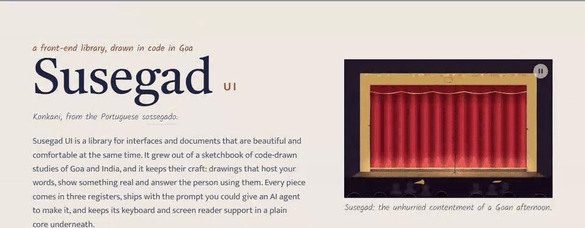
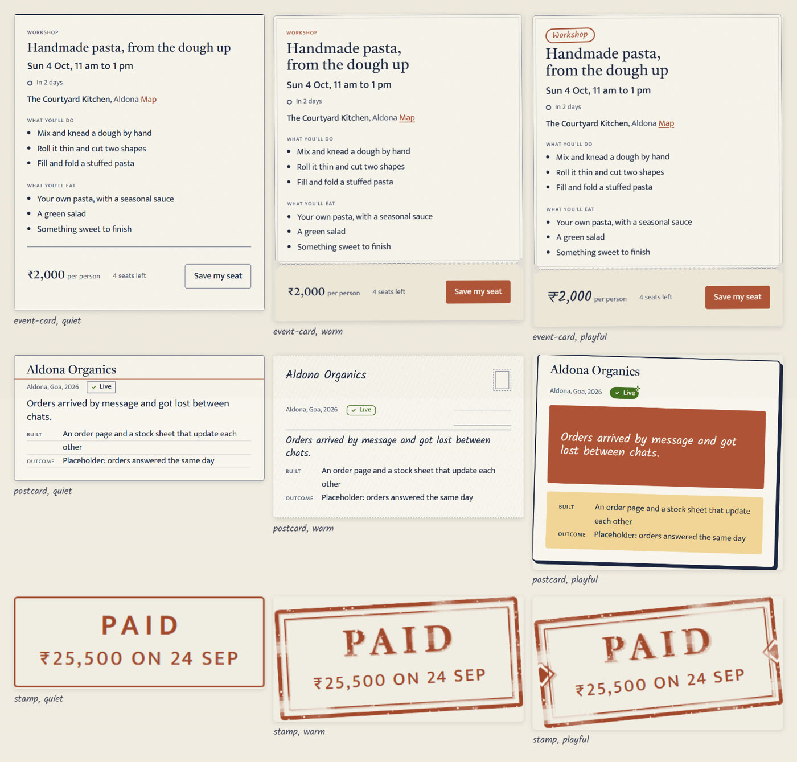
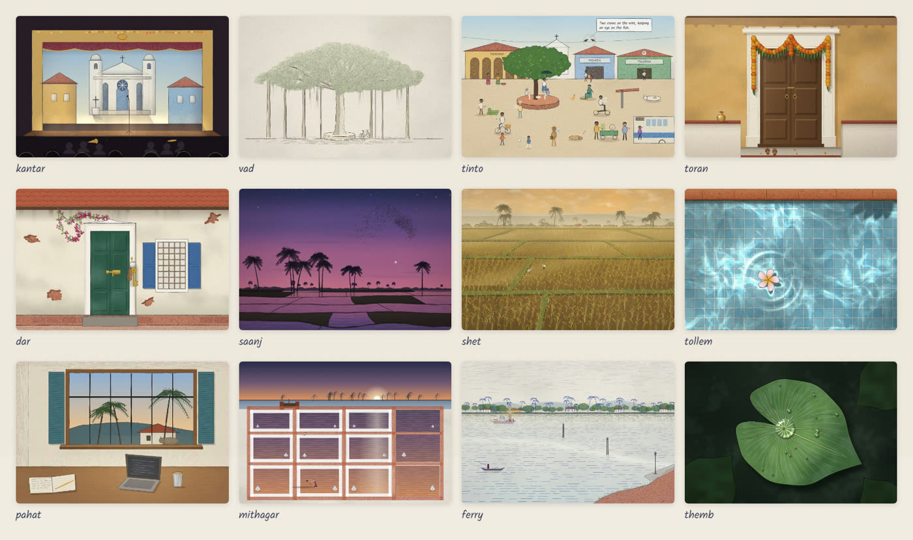

# Susegad UI

<a href="https://susegad.asymmetrica.ai"><picture>
  <source media="(prefers-color-scheme: dark)" srcset="docs/readme/hero.dark.gif">
  
</picture></a>

> *For Rafe, who lent two stranded strangers his Activa and went fishing.* ([DEDICATION.md](DEDICATION.md))

A front-end library for interfaces and documents that are beautiful and comfortable at the same time.

*Susegad* is Konkani, from the Portuguese *sossegado*: the unhurried contentment of a Goan afternoon.

Every component has three registers, from a hairline-quiet version for an auditor to a playful one for a festival. Each one ships with the prompt you could give an AI agent to make it, and components copy into your project so you own the code, the way shadcn/ui works. The pieces are plain custom elements with no dependencies, so they work in a static page, in Svelte or Astro, or behind htmx. Folio, the document layer, turns a single self-contained HTML file into something better than a PDF.

<a href="https://susegad.asymmetrica.ai/components"><picture>
  <source media="(prefers-color-scheme: dark)" srcset="docs/readme/registers.dark.jpg">
  
</picture></a>

<sub>The same three pieces in each register. The words and the keyboard behaviour don’t change; only the look does.</sub>

It's early, and it's MIT licensed. Have a look around, take what you like, and tell us what's missing.

- See it: **[susegad.asymmetrica.ai](https://susegad.asymmetrica.ai)**, and every piece, live, on [the components page](https://susegad.asymmetrica.ai/components)
- What it is: [`docs/CHARTER.md`](docs/CHARTER.md)
- Why things are the way they are: [`docs/decisions/`](docs/decisions/)
- What changed, and what's next to release: [`CHANGELOG.md`](CHANGELOG.md), [`docs/RELEASING.md`](docs/RELEASING.md)
- Using it with an AI agent: [`SKILL.md`](SKILL.md), or the site's [`/llms.txt` and `/llms-full.txt`](https://susegad.asymmetrica.ai/llms.txt) (llmstxt.org)
- The elements themselves, machine-readable: [`custom-elements.json`](custom-elements.json)
- For agents working on the library: [`AGENTS.md`](AGENTS.md)

## Scenes

Drawings made in code, of Goa and India, that host your words: a stage for a hero, a doorway for an empty state, a monsoon window for a loading page. Each one draws itself, rests when it's done, and holds still for anyone who asks for less motion.

<a href="https://susegad.asymmetrica.ai/scenes"><picture>
  <source media="(prefers-color-scheme: dark)" srcset="docs/readme/scenes.dark.jpg">
  
</picture></a>

<sub>kantar, vad, tinto, toran, dar, saanj, shet, tollem, pahat, mithagar, ferry, themb. All 32 are on <a href="https://susegad.asymmetrica.ai/scenes">the scenes page</a>, each with its prompt.</sub>

## Take a piece

Clone the repository, then copy what you need into your project with the command line (Node 22 or later, no dependencies):

```sh
git clone https://github.com/sarat-asymmetrica/susegad-ui
node susegad-ui/packages/cli/bin/susegad.mjs list
node susegad-ui/packages/cli/bin/susegad.mjs add stamp date-range --dir src/lib
```

The files you add are yours to change. `susegad diff` tells you where your copy and the library have drifted apart. More in [`packages/cli/README.md`](packages/cli/README.md).

## Run it here

```sh
npm ci
npm run serve        # then open http://127.0.0.1:5173/apps/docs/
npm test             # the pure cores
npm run check        # the browser checks (Playwright, Chromium by default; see docs/BROWSERS.md for WebKit and Firefox)
```
